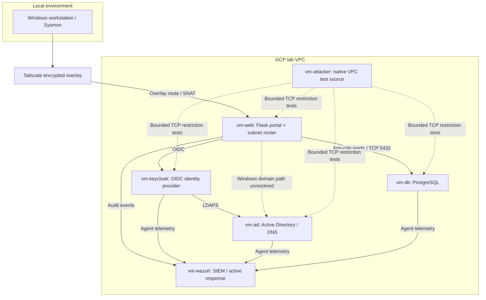

# Zero Trust Lab: Identity, Segmentation and Detection

**Author:** Chouaib Laredj · Engineering student, ENSA Khouribga

An academic hybrid-cloud lab comparing selected security controls with a permissive baseline. Five GCP service VMs (AD, Keycloak, Flask, PostgreSQL and Wazuh), one GCP attacker VM and one local Windows workstation form the experimental environment.

## Results at a glance

| Control | Recorded result | Evidence |
|---|---|---|
| OIDC and Flask RBAC | Employee /admin changed from 200 to 403; authorized administrator received 200; employee business access remained 200 | [RBAC](evidence/rbac.md) |
| Targeted GCP network restriction | Fixed eight TCP target-port pairs from vm-attacker: 8/8 open before, 0/8 open and 8/8 filtered after | [Network comparison](evidence/network.md) |
| PostgreSQL least privilege | Required reads preserved; tested unauthorized write/creation operations returned SQLSTATE 42501 | [Database](evidence/database.md) |
| Wazuh detection | Five correlated authorization-denial alerts; mean source-event-to-manager-alert timestamp difference 0.980 s | [Detection](evidence/wazuh.md) |
| Active response and LDAPS | Recorded synthetic-event firewall-drop demonstration and directory TLS hardening | [Campaign provenance](evidence/later-campaigns.md) |

The eight-pair scan used the native GCP attacker path and a targeted priority 900 deny. It is separate from the later five service ingress slices and assumed-web-host-access checks. These results cover tested paths and accounts, not universal protection or production readiness.

## Architecture



Solid edges describe intended service relationships, not a fresh end-to-end verification. The dotted domain edge marks the unresolved Windows path through the shared router; dotted attacker edges identify the tested matrix, whose eight TCP pairs were filtered after the targeted deny. The latest AD source exception admits the web/router for selected services.

AD supplies directory identity; Keycloak federates it and provides OIDC. The Flask portal enforces route roles and reads synthetic PostgreSQL data. Wazuh collects security events and supports active response. Tailscale bridges the local workstation through a shared web/subnet router.

Five server ingress slices were recorded at priorities 800/850 and the broad `allow-internal-vpc` baseline was disabled. Later AD source exceptions changed the web/router isolation boundary; see [recorded policies](controls/network-policy.md).

## Known architectural limitations

Windows default DNS and domain-controller discovery remained unresolved even after explicit AD DNS succeeded. SNAT through the shared router also complicates source-based GCP policy and client attribution. These observations establish hybrid integration friction, not a proven single root cause. Further repair was deferred when technical scope froze on October 8. [Hybrid evidence and impact](evidence/hybrid.md).

The application role retains SELECT, so stolen credentials can expose readable data. The response demonstration used a synthetic event; containment expiry and distinct-client attribution were not established. The observed OTP path does not establish every alternate/recovery flow. [Evidence scope](evidence/index.md).

## Repository contents and provenance

- [`app/`](app/README.md): cleaned OIDC/RBAC portfolio adaptation; **not an exact export of the deployed app**.
- [`app/baseline/`](app/baseline/README.md): intentionally unauthenticated historical baseline, with embedded credentials removed.
- [`infrastructure/terraform/`](infrastructure/README.md): historical baseline Terraform, not final hardened infrastructure-as-code.
- [`controls/`](controls/README.md): copied database transaction and explicitly reconstructed Wazuh references.
- [`evidence/`](evidence/index.md): dated summaries and machine-readable scan extracts; historical results remain separate from local code checks.
- [`docs/report/`](docs/report/README.md): portable public LaTeX/PDF edition; unreviewed screenshots are omitted.
- [`tests/`](tests/validation-procedures.md): offline authorization checks and bounded lab validation procedures.

## Local inspection

**Prerequisites:** Python 3.12 (the version used for the verified dependency lock and tests), `pip`, and a local virtual environment. Run the following PowerShell commands from the repository root:

```powershell
py -3.12 -m venv .venv
.\.venv\Scripts\python.exe -m pip install -r app/requirements.lock.txt
.\.venv\Scripts\python.exe -m unittest discover -s tests -v
```

The nine offline checks require **no running Keycloak, PostgreSQL, GCP VMs or Tailscale connection**. You do not need to export environment variables for these tests: the test module generates temporary synthetic configuration and mocks database access. Dependency installation needs network access unless the packages are already cached; the tests themselves are offline.

Running the actual portal is separate: follow [application setup](app/README.md) and supply the variables in [the configuration example](config/.env.example) for your own isolated Keycloak/database environment. No working credentials or production data are supplied. Do not run baseline Terraform as a hardened deployment.

Technical implementation scope is frozen. The portfolio presents successes and accepted limitations using existing evidence. [Package status](docs/STATUS.md).
